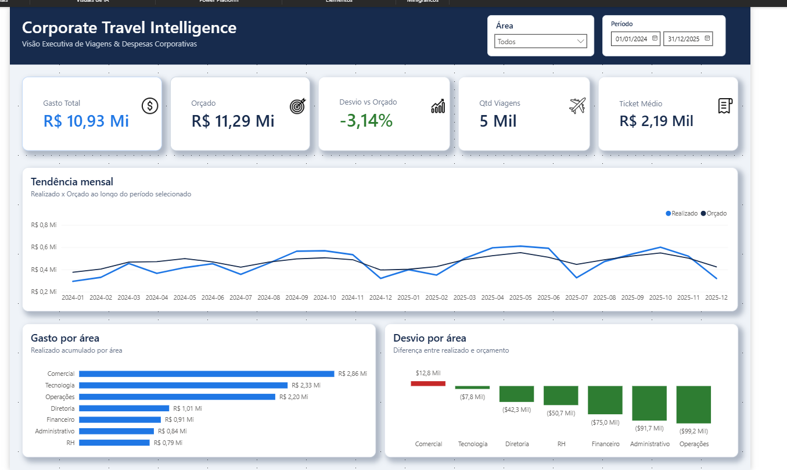

# Corporate Travel Intelligence

Case de Business Intelligence aplicado à gestão de viagens corporativas, construído em Power BI no formato PBIP/PBIR a partir de dados sintéticos e regras de tratamento auditáveis.



## Visão Geral

O projeto responde à pergunta: como uma empresa pode acompanhar custos, orçamento, comportamento de compra, fornecedores e conformidade de viagens em uma experiência analítica única?

O relatório combina dados sintéticos, Power Query, modelo semântico, medidas DAX e uma página executiva com foco em leitura rápida por gestores. A estrutura PBIP/PBIR permite versionar e revisar a camada visual como arquivos de projeto.

## Problema de Negócio

Viagens corporativas costumam envolver múltiplas fontes, centros de custo, áreas, fornecedores e eventos operacionais como remarcações, cancelamentos e gastos fora de política. Sem uma visão consolidada, a gestão perde rastreabilidade sobre orçamento, tendência mensal, áreas de maior gasto e desvios relevantes.

## Objetivos

- Consolidar dados de viagens, orçamento, aéreo, hospedagem, despesas, viajantes e centros de custo.
- Demonstrar tratamento de qualidade em dados sintéticos com problemas controlados.
- Construir modelo dimensional simples, com calendário próprio e medidas explícitas.
- Criar uma visão executiva limpa para acompanhamento de gasto, orçamento, viagens, ticket médio e desvio.
- Documentar decisões técnicas, limitações e roadmap de evolução.

## Dashboard

Página confirmada no PBIR:

- `01 - Visão Executiva`: visão executiva com KPIs, evolução mensal, gasto por área, desvio por área e filtros de Área e Período.

Principais componentes da página executiva:

- KPIs: Gasto Total, Orçado, Desvio %, Qtd Viagens e Ticket Médio.
- Tendência mensal: Realizado x Orçado por `DimData[AnoMes]`.
- Análise por área: gasto realizado e desvio orçamentário por `centros_custo_raw[area]`.
- Filtros: Área e Data/Período.

## Principais KPIs

- Gasto Total: soma do gasto realizado das viagens.
- Orçado: soma do orçamento.
- Desvio R$: diferença entre realizado e orçado.
- Desvio %: desvio dividido pelo orçamento.
- Qtd Viagens: contagem distinta de viagens.
- Ticket Médio: gasto total dividido pela quantidade de viagens.
- Saving Estimado, Taxa Fora da Política, Antecedência Média, Compras com menos de 7 dias, Tempo Médio de Aprovação e indicadores de aéreo/hospedagem complementam a análise.

Veja detalhes em [docs/kpi_dictionary.md](docs/kpi_dictionary.md).

## Arquitetura


## Dataset

O dataset é sintético e publicável. Os arquivos brutos locais possuem:

| Arquivo | Linhas brutas | Colunas | Chave principal |
|---|---:|---:|---|
| `viagens_raw.csv` | 5.015 | 27 | `viagem_id` |
| `despesas_raw.csv` | 15.402 | 6 | `despesa_id` |
| `orcamento_raw.csv` | 552 | 4 | `mes_referencia` + `centro_custo_id` |
| `aereo_raw.csv` | 4.564 | 10 | `viagem_id` |
| `hospedagem_raw.csv` | 3.999 | 7 | `viagem_id` |
| `viajantes_raw.csv` | 190 | 7 | `viajante_id` |
| `centros_custo_raw.csv` | 23 | 4 | `centro_custo_id` |

Após as regras aplicadas no Power Query, foram confirmadas chaves distintas de 5.000 viagens e 15.372 despesas.

## ETL e Qualidade

As consultas M aplicam conversão de tipos, localidade `en-US` para campos numéricos, tratamento de datas inválidas, remoção de duplicidades, padronização textual e preenchimento controlado de campos ausentes. O repositório também inclui um gerador Python determinístico para criar novas bases sintéticas com o mesmo contrato de colunas.

Detalhes em [docs/etl.md](docs/etl.md).

## Modelagem

O modelo usa uma tabela calculada `DimData` cobrindo 01/01/2024 a 31/12/2025 e medidas centralizadas na tabela `_Medidas`. As relações conectam viagens, orçamento, despesas, aéreo, hospedagem, viajantes e centros de custo.

Detalhes em [docs/modeling.md](docs/modeling.md).

## Design e UX

A página executiva foi redesenhada para ter linguagem de produto analítico corporativo, com header executivo, filtros integrados, cards de KPI com hierarquia forte, superfícies brancas sobre fundo claro e cores semânticas controladas.

Detalhes em [docs/design_system.md](docs/design_system.md).

## Automação PBIR + IA

O formato PBIP/PBIR permitiu editar propriedades visuais diretamente em JSON, mantendo medidas, campos e interações preservados. A IA foi usada como acelerador de engenharia visual e documentação, não como fonte de cálculo de negócio.

Detalhes em [docs/pbir_automation.md](docs/pbir_automation.md).

## Estrutura do Repositório

```text
.
├── Corporate_Travel_Intelligence.pbip
├── Corporate_Travel_Intelligence.Report/
├── Corporate_Travel_Intelligence.SemanticModel/
├── *_raw.csv
├── assets/
│   └── dashboard_visao_executiva.png
├── scripts/
│   └── generate_synthetic_data.py
├── docs/
└── README.md
```

## Como Executar

1. Clone o repositório.
2. Abra `Corporate_Travel_Intelligence.pbip` no Power BI Desktop.
3. Se necessário, ajuste os caminhos das fontes CSV no Power Query para a pasta local do projeto.
4. Atualize os dados.
5. Abra a página `01 - Visão Executiva`.

Para gerar uma nova amostra sintética sem sobrescrever os CSVs publicados:

```bash
python scripts/generate_synthetic_data.py
```

Para gerar diretamente na raiz do projeto, use conscientemente:

```bash
python scripts/generate_synthetic_data.py --output-dir . --overwrite
```

## Tecnologias

- Power BI Desktop
- Power Query / M
- DAX
- PBIP / PBIR / JSON
- TMDL
- CSV
- Python
- Git/GitHub
- Codex/IA aplicada ao fluxo de documentação e ajuste visual

## Decisões Técnicas

As principais decisões estão registradas em [docs/decisions.md](docs/decisions.md).

## Limitações

Este é um case controlado de portfólio. Não há integração real com agência, ERP, Data Lake, refresh corporativo, RLS/autenticação ou arquitetura cloud complexa confirmada nos arquivos atuais.

## Roadmap

Evoluções planejadas estão em [docs/roadmap.md](docs/roadmap.md).

## Autor

Marcos Ramos
