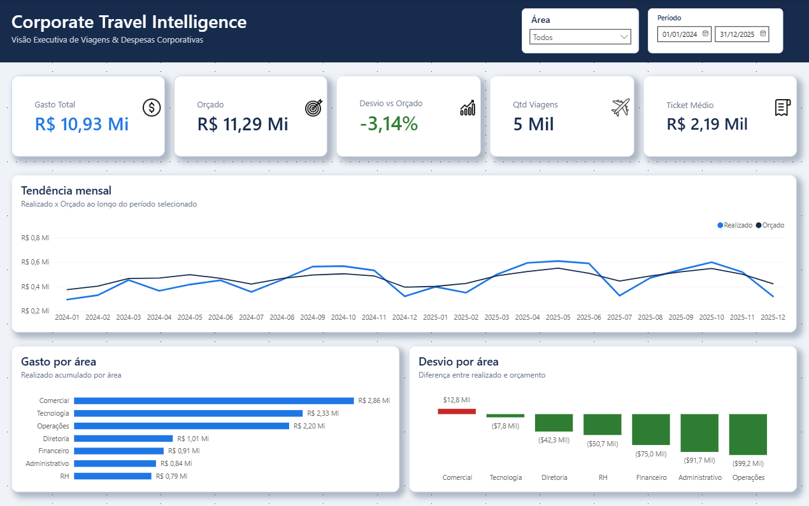
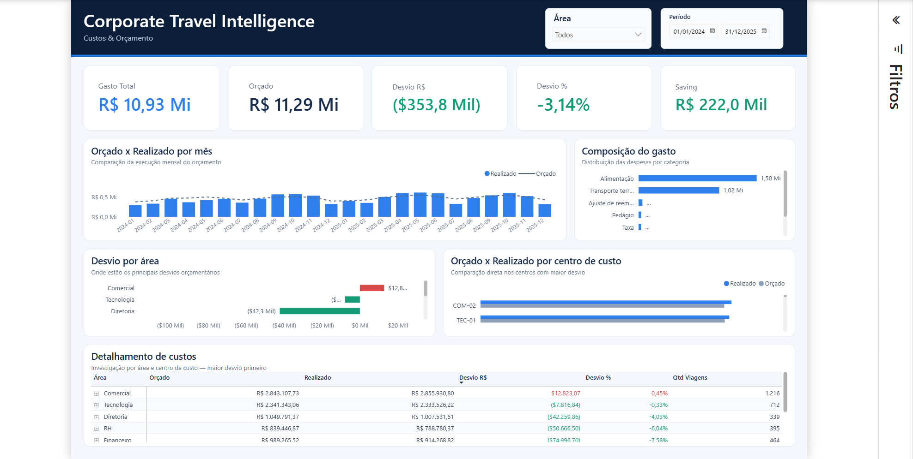
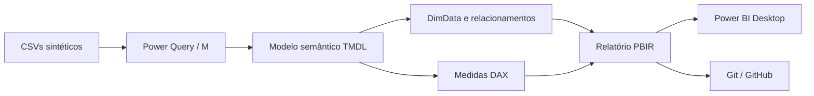

# Corporate Travel Intelligence

Projeto de Business Intelligence para gestão de viagens corporativas, desenvolvido em Power BI no formato PBIP/PBIR. O case combina dados sintéticos, tratamento em Power Query, modelo semântico em TMDL, medidas DAX, design executivo e versionamento da camada visual.

> Os dados são integralmente sintéticos. O projeto foi construído para portfólio e não representa uma empresa ou operação real.



## Objetivo do projeto

Consolidar custos, orçamento e indicadores operacionais de viagens para responder duas perguntas principais:

1. **Como está a operação?** — visão executiva de gasto, orçamento, volume e tendência.
2. **Onde estão os gastos e desvios?** — aprofundamento financeiro por mês, categoria, área e centro de custo.

O projeto demonstra competências em modelagem e medidas DAX, Power Query, qualidade de dados, dashboards executivos, autoria PBIP/PBIR como código e documentação técnica.

## Estado atual do dashboard

O relatório possui duas páginas em canvas `1440 × 900`:

| Página | Pergunta respondida | Conteúdo atual |
|---|---|---|
| `01 - Visão Executiva` | Como está a operação? | Cinco KPIs, tendência mensal, gasto por área, desvio por área e filtros de Área e Período |
| `02 - Custos & Orçamento` | Onde gastamos e onde estão os desvios? | Cinco KPIs, realizado x orçamento mensal, composição das despesas, desvios por área, comparação por centro de custo e matriz de detalhamento |

### Página 1 — Visão Executiva

- KPIs: Gasto Total, Orçado, Desvio %, Qtd Viagens e Ticket Médio.
- Tendência mensal: Realizado e Orçado por `DimData[AnoMes]`.
- Ranking de gasto por área.
- Desvio orçamentário divergente por área em Deneb/Vega-Lite.
- Filtros de Área e Período.

### Página 2 — Custos & Orçamento



- KPIs: Gasto Total, Orçado, Desvio R$, Desvio % e Saving.
- Orçado x Realizado por mês, com realizado em colunas e orçamento em linha.
- Composição das despesas por `despesas_raw[categoria]`.
- Desvio por Área com hierarquia Área → Centro de Custo.
- Orçado x Realizado por Centro de Custo.
- Matriz de detalhamento financeiro.

### Refinamento analítico identificado

Os gráficos `Tendência mensal`, na Página 1, e `Orçado x Realizado por mês`, na Página 2, usam as mesmas medidas e granularidade. Embora tenham representações diferentes, existe sobreposição analítica. A evolução recomendada é manter a tendência na Página 1 e substituir o gráfico da Página 2 por um **Desvio mensal**, com barras divergentes em torno de zero.

## Regras de negócio essenciais

### Gasto e orçamento

- **Gasto Total** é a soma de `viagens_raw[gasto_total_realizado]`.
- **Orçado** é a soma de `orcamento_raw[orcado]`.
- O orçamento está no grão **mês × centro de custo**.
- Realizado e orçamento compartilham o contexto temporal pela `DimData` e o contexto organizacional por `centros_custo_raw`.

### Desvio orçamentário

```DAX
Desvio R$ = [Gasto Total] - [Orçado]
```

| Resultado numérico | Interpretação | Cor |
|---:|---|---|
| Maior que zero | Gasto acima do orçamento; situação desfavorável | Vermelho |
| Menor que zero | Gasto abaixo do orçamento; situação favorável | Verde |
| Igual a zero | Execução exatamente igual ao orçamento | Neutro |

Um desvio exibido como `(R$ 43 mil)` ou `-R$ 43 mil`, em verde, significa que a operação gastou **R$ 43 mil abaixo do orçamento**. Ele é favorável para o negócio, embora seja numericamente negativo.

```DAX
Desvio % = DIVIDE([Desvio R$], [Orçado], 0)
```

### Saving não é desvio orçamentário

O desvio compara o realizado com o **orçamento aprovado**. O saving compara o realizado com um **valor de referência da viagem**.

```DAX
Saving Estimado = SUM(viagens_raw[saving_estimado])

Saving % =
DIVIDE(
    [Saving Estimado],
    SUM(viagens_raw[valor_referencia]),
    0
)
```

Por utilizarem bases diferentes, `Desvio R$` e `Saving Estimado` não precisam coincidir. Exemplo: orçamento de R$ 1.000, referência de R$ 900 e realizado de R$ 800 produzem R$ 200 de desvio favorável e R$ 100 de saving.

> **Limitação conhecida:** no CSV atual, 30 das 5.000 viagens distintas não reconciliam `saving_estimado = valor_referencia - gasto_total_realizado`. A diferença acumulada dessas ocorrências é R$ 65.338,70. Até a regra ser revisada, Saving deve ser tratado como indicador experimental, não como KPI financeiro auditado.

### Composição por categoria

- A composição por categoria usa `SUM(despesas_raw[valor])`.
- Ela representa a distribuição das **despesas registradas**, não a decomposição integral do `Gasto Total`.
- Aéreo e hospedagem estão em estruturas próprias e no consolidado de viagens.
- O orçamento não possui categoria; portanto, não é correto decompor o orçamento em Aéreo, Hospedagem, Alimentação etc.
- Por esse motivo, o waterfall por categoria não foi implementado. A alternativa adotada foi comparar Orçado e Realizado por Centro de Custo.

As regras completas estão em [docs/business_rules.md](docs/business_rules.md), e o catálogo de medidas em [docs/kpi_dictionary.md](docs/kpi_dictionary.md).

## Arquitetura


```mermaid
flowchart LR
    A[CSVs sintéticos] --> B[Power Query / M]
    B --> C[Modelo semântico TMDL]
    C --> D[DimData e relacionamentos]
    C --> E[Medidas DAX]
    D --> F[Relatório PBIR]
    E --> F
    F --> G[Power BI Desktop]
    F --> H[Git / GitHub]
```

| Camada | Implementação |
|---|---|
| Fonte | Sete arquivos CSV sintéticos |
| Transformação | Consultas M armazenadas nas partitions TMDL |
| Modelo | Nove tabelas, incluindo `DimData` e `_Medidas` |
| Métricas | 21 medidas DAX centralizadas em `_Medidas` |
| Relatório | Duas páginas PBIR, 28 visuais no total |
| Visual customizado | Deneb somente no desvio por área da Página 1 |
| Versionamento | PBIP/PBIR, TMDL, JSON, Markdown e Git |

## Modelo de dados

| Tabela | Papel | Grão |
|---|---|---|
| `viagens_raw` | Fato principal | Uma viagem consolidada |
| `despesas_raw` | Fato de despesas | Uma despesa por viagem |
| `orcamento_raw` | Fato orçamentário | Um mês por centro de custo |
| `aereo_raw` | Detalhamento aéreo | Um registro aéreo por viagem |
| `hospedagem_raw` | Detalhamento de hospedagem | Um registro por viagem |
| `viajantes_raw` | Dimensão cadastral | Um viajante |
| `centros_custo_raw` | Dimensão organizacional | Um centro de custo |
| `DimData` | Dimensão calendário | Um dia entre 2024 e 2025 |
| `_Medidas` | Tabela técnica | Medidas DAX |

O Auto Date/Time foi desativado. A análise temporal principal depende explicitamente de `DimData[Data]`, relacionada a `viagens_raw[data_ida]` e `orcamento_raw[mes_referencia]`.

Veja [docs/modeling.md](docs/modeling.md) e [docs/data_dictionary.md](docs/data_dictionary.md).

## Dados e qualidade

| Arquivo | Linhas brutas | Chave lógica |
|---|---:|---|
| `viagens_raw.csv` | 5.015 | `viagem_id` |
| `despesas_raw.csv` | 15.402 | `despesa_id` |
| `orcamento_raw.csv` | 552 | `mes_referencia` + `centro_custo_id` |
| `aereo_raw.csv` | 4.564 | `viagem_id` |
| `hospedagem_raw.csv` | 3.999 | `viagem_id` |
| `viajantes_raw.csv` | 190 | `viajante_id` |
| `centros_custo_raw.csv` | 23 | `centro_custo_id` |

O Power Query trata tipos, localidade numérica, datas inválidas, duplicidades, grafias inconsistentes e campos ausentes. Depois do tratamento, permanecem 5.000 viagens distintas e 15.372 despesas distintas.

Detalhes em [docs/etl.md](docs/etl.md).

## Design e experiência

O dashboard utiliza um sistema visual corporativo único:

- canvas `1440 × 900` e fundo `#F4F7FB`;
- header azul-marinho `#0B1F3A`;
- azul `#2F80ED` para realizado e informação principal;
- verde `#159B76` exclusivamente para situação favorável;
- vermelho `#D94B4B` exclusivamente para situação desfavorável;
- cards brancos, borda `#DCE5F0`, raio de 12 px e sombras mínimas;
- espaçamento baseado em múltiplos de 8 px;
- filtros de Área e Período integrados ao header.

Os filtros das duas páginas utilizam os mesmos campos, mas ainda não estão sincronizados entre páginas. Veja [docs/design_system.md](docs/design_system.md).

## Estrutura do repositório

```text
.
├── Corporate_Travel_Intelligence.pbip
├── Corporate_Travel_Intelligence.Report/
│   └── definition/pages/
├── Corporate_Travel_Intelligence.SemanticModel/
│   └── definition/
├── *_raw.csv
├── assets/
├── docs/
├── scripts/
│   └── build_page2.js
└── README.md
```

## Como executar

1. Clone o repositório.
2. Abra `Corporate_Travel_Intelligence.pbip` no Power BI Desktop.
3. Caso necessário, ajuste os caminhos absolutos dos CSVs nas consultas Power Query.
4. Atualize os dados.
5. Navegue entre `01 - Visão Executiva` e `02 - Custos & Orçamento`.

### Validação PBIR

Com o pacote `@microsoft/powerbi-report-authoring-cli` instalado:

```powershell
powerbi-report-author validate Corporate_Travel_Intelligence.Report --pretty
```

Última validação executada durante a construção da Página 2: **0 erros**. Os avisos restantes estavam limitados à indisponibilidade dos schemas remotos da Microsoft durante a execução.

## Limitações conhecidas

- Os caminhos das fontes CSV estão absolutos e precisam ser parametrizados para portabilidade completa.
- Os filtros Área e Período ainda não estão sincronizados entre as duas páginas.
- Os dois gráficos mensais atuais apresentam sobreposição analítica.
- O orçamento não possui granularidade por categoria.
- O Saving possui 30 registros distintos sem reconciliação com referência menos realizado.
- Não há refresh em nuvem, RLS, gateway, autenticação ou integração com sistemas reais.
- O projeto não deve ser usado como benchmark financeiro ou operacional.

## Documentação

| Documento | Conteúdo |
|---|---|
| [Regras de negócio](docs/business_rules.md) | Semântica financeira, sinais, cores, grãos e limitações |
| [Arquitetura](docs/architecture.md) | Camadas, componentes e fluxo técnico |
| [Modelagem](docs/modeling.md) | Tabelas, relacionamentos e calendário |
| [Dicionário de dados](docs/data_dictionary.md) | Campos, tipos, grãos e chaves |
| [Dicionário de KPIs](docs/kpi_dictionary.md) | Medidas DAX e interpretação |
| [ETL e qualidade](docs/etl.md) | Transformações Power Query |
| [Design system](docs/design_system.md) | Paleta, layout e padrões visuais |
| [Decisões técnicas](docs/decisions.md) | ADRs e trade-offs |
| [Automação PBIR](docs/pbir_automation.md) | Autoria, validação e estrutura visual |
| [Roadmap](docs/roadmap.md) | Entregas concluídas e próximas etapas |
| [Auditoria do repositório](docs/repository_audit.md) | Inventário técnico atual |

## Tecnologias

- Power BI Desktop
- Power Query / M
- DAX
- PBIP / PBIR / JSON
- TMDL
- Deneb / Vega-Lite
- Node.js
- Git e GitHub

## Autor

Marcos Ramos
