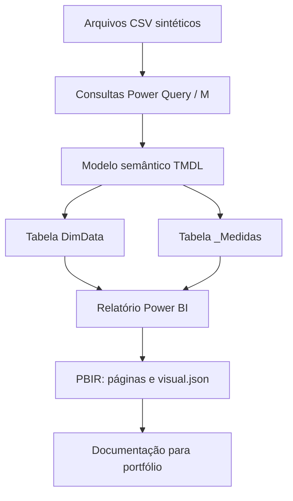

# Arquitetura

## Escopo

O projeto é um case de Business Intelligence para viagens corporativas, construído em Power BI com arquivos versionáveis no formato PBIP/PBIR.

## Fluxo Confirmado

## Camadas

| Camada | Artefatos | Responsabilidade |
|---|---|---|
| Fonte | `*_raw.csv` | Dados sintéticos brutos publicados com o projeto |
| Transformação | Partitions M nos arquivos `.tmdl` | Tipagem, limpeza, padronização e regras de qualidade |
| Modelo | `Corporate_Travel_Intelligence.SemanticModel/definition` | Tabelas, relacionamentos, DimData e medidas |
| Relatório | `Corporate_Travel_Intelligence.Report/definition` | Páginas, visuais, filtros e formatação PBIR |
| Documentação | `README.md` e `docs/` | Explicação técnica e narrativa de portfólio |

## Artefatos Principais

- `Corporate_Travel_Intelligence.pbip`: arquivo de abertura do projeto no Power BI.
- `Corporate_Travel_Intelligence.Report/definition.pbir`: referência do relatório ao modelo semântico por caminho relativo.
- `Corporate_Travel_Intelligence.SemanticModel/definition.pbism`: definição do modelo semântico.
- `Corporate_Travel_Intelligence.SemanticModel/definition/tables/*.tmdl`: tabelas, colunas, medidas e consultas M.
- `Corporate_Travel_Intelligence.Report/definition/pages/*`: páginas e visuais em PBIR.

## Reprodutibilidade

As consultas M atualmente apontam para caminhos locais absolutos nos arquivos TMDL. Para outra máquina, pode ser necessário ajustar a origem dos CSVs no Power Query.

## Segurança

Os dados são sintéticos. Não foram identificadas credenciais em arquivos de texto inspecionados. Arquivos locais de cache, backups e PBIX foram adicionados ao `.gitignore`.
